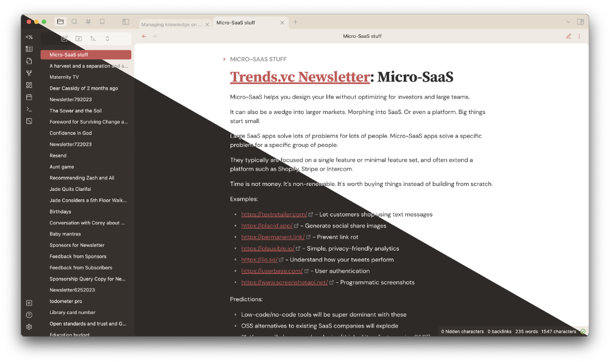

  A CSS theme for Obsidian!

---

### Note: this still needs to be updated for Obsidian v1.0, consider it legacy until that is done!

## To use

Install it!

There are some font defaults that will work out of the box, but I recommend you install these fonts (for free!) for the full theme design:

- [Source Serif](https://fonts.google.com/specimen/Source+Serif+4)
- [DM Sans](https://fonts.google.com/specimen/DM+Sans)
